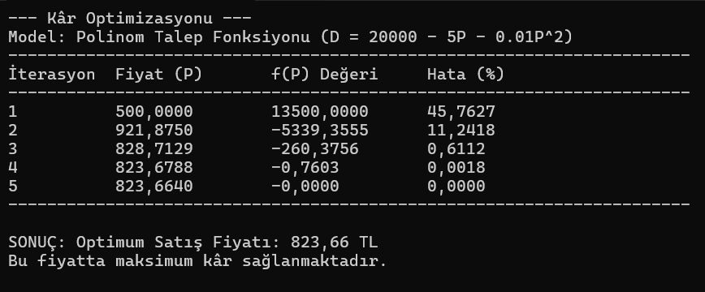

# MAT 217 SAYISAL ANALİZ PROJE ÖDEVİ

* **Öğrenci Adı Soyadı:** Agah Faruk Küçük
* **Öğrenci Numarası:** B241200004
* **Bölüm:** Bilişim Sistemleri Mühendisliği
* **Ders:** MAT 217 Sayısal Analiz
* **Proje Konusu:** Ürün Fiyatını Bulma (Kâr Optimizasyonu)

---

## 1. PROBLEMİN TANIMI (İSTER 1)

**Problemin Tanımı ve İlgili Sistem:**
Bu proje kapsamında, rekabetçi bir e-ticaret pazarında satışa sunulacak olan yeni nesil bir **"Gürültü Engelleyici Kablosuz Kulaklık"** için en uygun satış fiyatının belirlenmesi problemi ele alınmıştır.

Fiyatlandırma stratejisi, bir işletmenin kârlılığı için kritik öneme sahiptir. Fiyatın artması birim başına kârı yükseltirken, pazar talebini (satış adedini) düşürmektedir. Bu zıt yönlü ilişki, optimum bir denge noktasının bulunmasını zorunlu kılar.

**Mühendislik Hedefi:**
Projenin temel hedefi, üretim maliyetleri ve pazarın talep esnekliği verileri ışığında, **toplam kârı ($K$)** maksimize edecek **optimum satış fiyatını ($P^*$)** sayısal analiz yöntemleri kullanarak ölçülebilir ve bilimsel bir yaklaşımla tespit etmektir. Bu süreçte deneme-yanılma yerine, mühendislik disiplinine uygun iteratif bir kök bulma algoritması kullanılacaktır.

---

## 2. FİZİKSEL MODELİN OLUŞTURULMASI

Gerçek hayat problemini daha hassas modellemek için **"Hızlanan Talep Düşüşü (Polinom)"** modeli benimsenmiştir:

* **Varsayım 1 (Maliyet - $C$):** Ürünün birim maliyeti $C = 400$ TL olarak güncellenmiştir.
* **Varsayım 2 (Talep Fonksiyonu - $D(P)$):** Fiyat arttıkça talebin sadece doğrusal değil, karesel bir etkiyle hızlanarak düştüğü varsayılmıştır:
  $$D(P) = 20000 - 5P - 0.01P^2$$
  *(Bu model, fiyat aşırı yükseldiğinde müşterinin üründen kaçış hızının arttığını simüle eder.)*
* **Kısıtlar:** Fiyat maliyetten büyük olmalıdır ($P > 400$).

---

## 3. MATEMATİK MODELİN OLUŞTURULMASI

Fiziksel modeldeki varsayımlar kullanılarak problem matematiksel denklemlere dökülmüştür.

**Kâr Fonksiyonu $K(P)$:**
$$K(P) = (P - 400) \cdot (20000 - 5P - 0.01P^2)$$

Bu fonksiyon açıldığında 3. dereceden (kübik) bir denklem elde edilir:
$$K(P) = -0.01P^3 - P^2 + 22000P - 8000000$$

**Optimizasyon ve Kök Denklemi $f(P)$:**
Maksimum kâr için türev alınıp sıfıra eşitlenir ($dK/dP = 0$). Elde edilen kök denklemi $f(P)$ şudur:
$$f(P) = -0.03P^2 - 2P + 22000 = 0$$

**Newton-Raphson İçin Türev $f'(P)$:**
Yöntem gereği, yukarıdaki fonksiyonun da türevi gereklidir:
$$f'(P) = -0.06P - 2$$

**Yöntem Seçimi:**
Elde edilen denklemin kökünü bulmak için **Newton-Raphson Yöntemi** seçilmiştir. Bu yöntemin seçilme nedeni, türev tabanlı olması sayesinde optimizasyon problemlerinde köke hızlı ve kararlı bir şekilde yakınsamasıdır.

---

## 4. ÇÖZÜMÜN VARLIĞI VE ANALİZİ

Newton-Raphson Yöntemi kullanılacaktır.

* **Kök Denklemi:** $f(P) = -0.03P^2 - 2P + 22000$
* **Denklemin Türevi:** $f'(P) = -0.06P - 2$

**Analiz:** Fonksiyonun türevi $f'(P)$ sabit bir sayı değil, $P$'ye bağlı değişen bir ifadedir. Bu durum, Newton-Raphson yönteminin tek adımda değil, iteratif adımlarla sonuca yaklaşacağını gösterir. Yöntem, parabolik eğrinin teğetlerini kullanarak köke (optimum fiyata) adım adım inecektir.

---

## 5. UYGUN BİR YÖNTEMLE MATEMATİKSEL MODELİN ÇÖZÜMÜ (İSTER 2 & 3)

Seçilen problemin çözümü, **C# programlama dili** kullanılarak kodlanmış ve Newton-Raphson algoritması uygulanmıştır.

**Algoritma Özeti:**
1. Başlangıç fiyat tahmini ($P_0$) ve hata toleransı tanımlanır.
2. Döngü içerisinde $f(P)$ ve $f'(P)$ değerleri hesaplanır.
3. Yeni fiyat değeri ($P_{yeni}$) formül ile bulunur.
4. Hata oranı kontrol edilir; toleransın altındaysa döngü sonlandırılır.

### Kod Çıktısı:

---

## 6. HATA ANALİZİ VE SONUÇ

**Sonuçların Değerlendirilmesi:**
Yapılan sayısal analiz sonucunda, maksimum kârı sağlayan optimum satış fiyatı **$P \approx 823.66$ TL** olarak bulunmuştur.

**Yakınsama Analizi:**
Kök denklemi 2. dereceden (non-lineer) olduğu için Newton-Raphson yöntemi çözüme tek adımda ulaşmamış, **5. iterasyonda** hata payını toleransın altına indirmiştir. Başlangıçta yüksek olan hata oranı, yöntemin kuadratik yakınsama özelliği sayesinde her adımda hızla azalmıştır.

**Doğrulama (Sağlama):**
Bulunan sonucun sağlaması yapıldığında:

* $P = 800$ TL için Kâr $\approx$ **3,840,000 birim**
* $P = 823.66$ TL için Kâr $\approx$ **3,854,334 birim (Maksimum)**
* $P = 850$ TL için Kâr $\approx$ **3,836,250 birim**

Bu analiz, **823.66 TL** noktasının gerçekten de tepe noktası olduğunu doğrulamaktadır.
